# Screenshots

Die Screenshots zeigen die Festkasse mit Beispieldaten. Namen,
Telefonnummern, Organisationen, Artikel und Umsätze sind Demodaten.

## Inhalt

- [Kassenbetrieb](#kassenbetrieb)
- [Auswertung](#auswertung)
- [Administration](#administration)

## Kassenbetrieb

### Kassenansicht

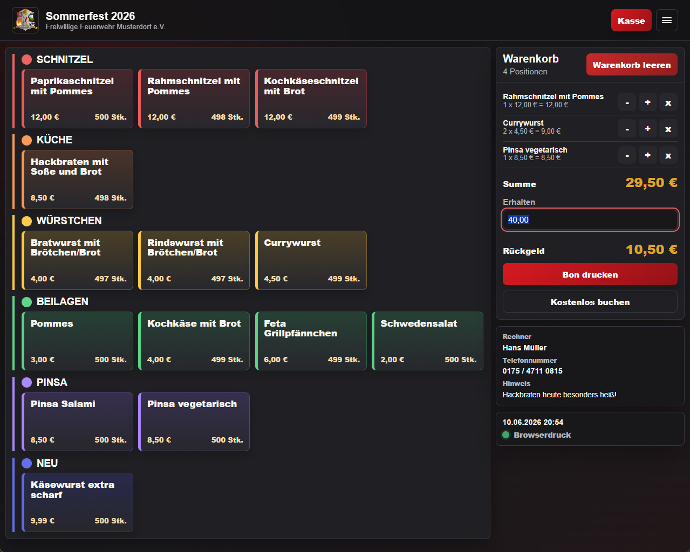

### Helles Design

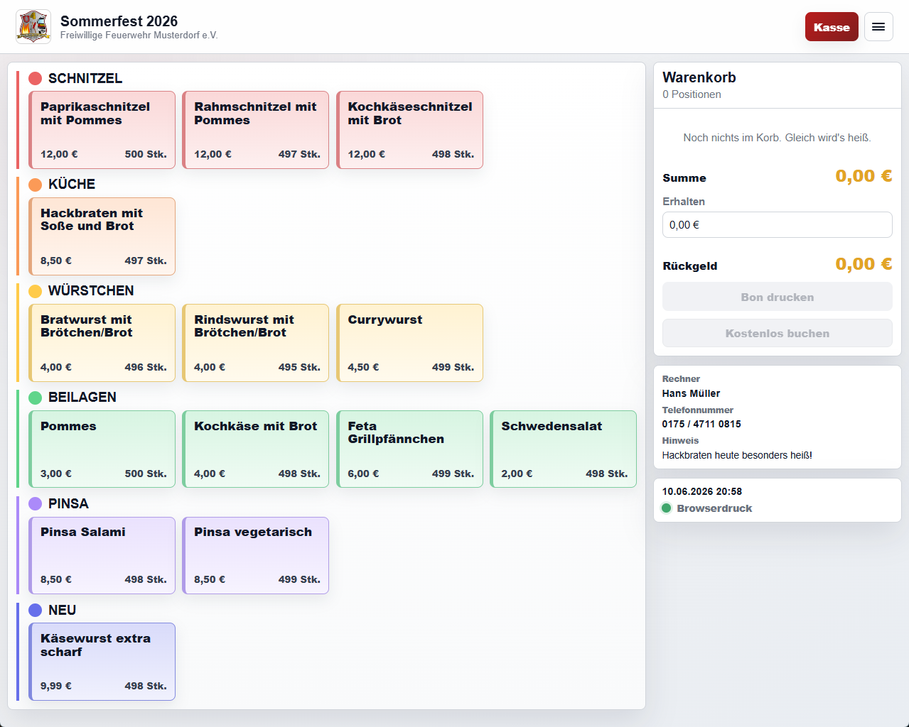

### Anmeldung

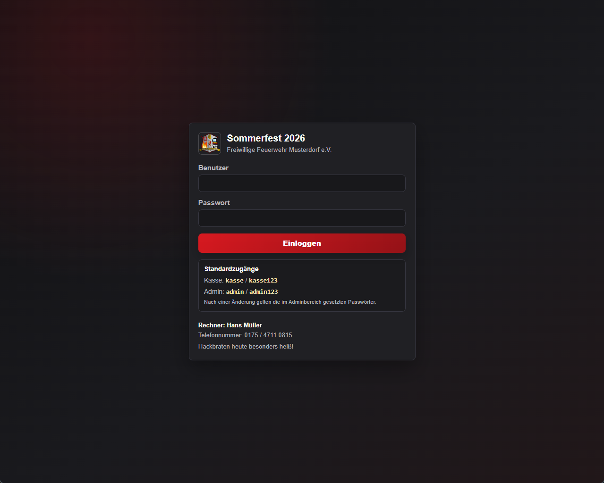

## Auswertung

### Tagesauswertung

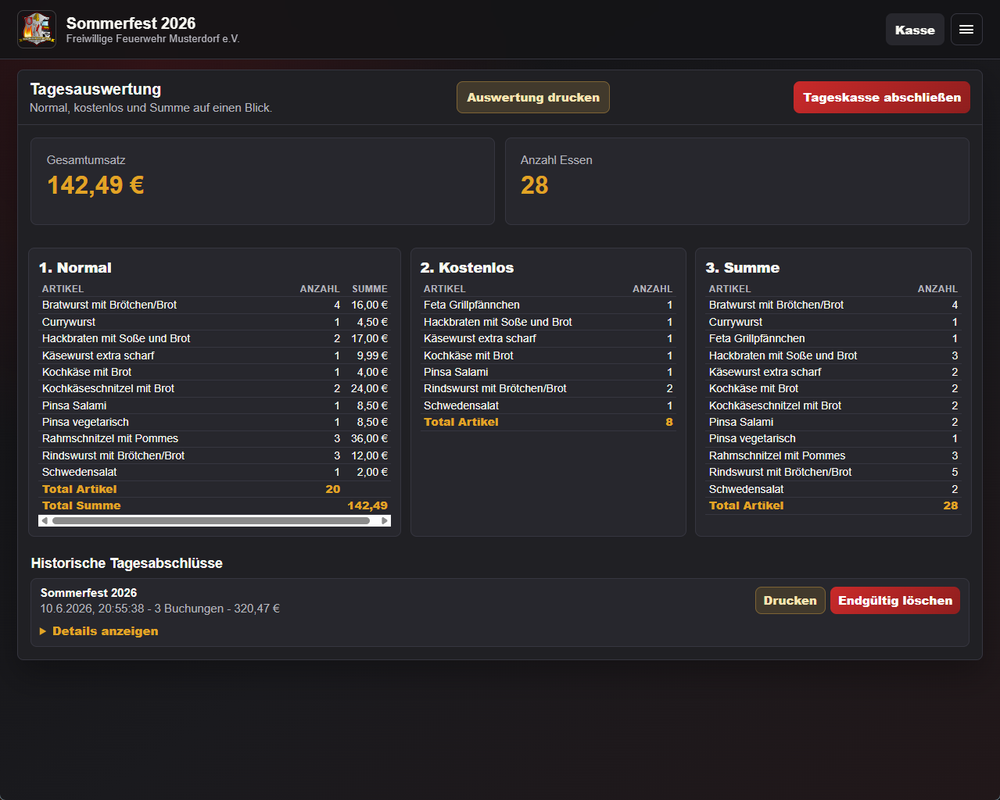

## Administration

### Administrationsmenü

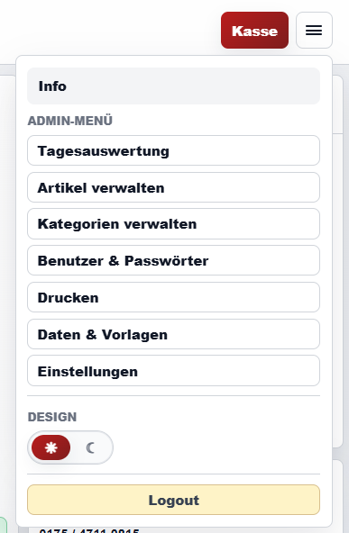

### Einstellungen

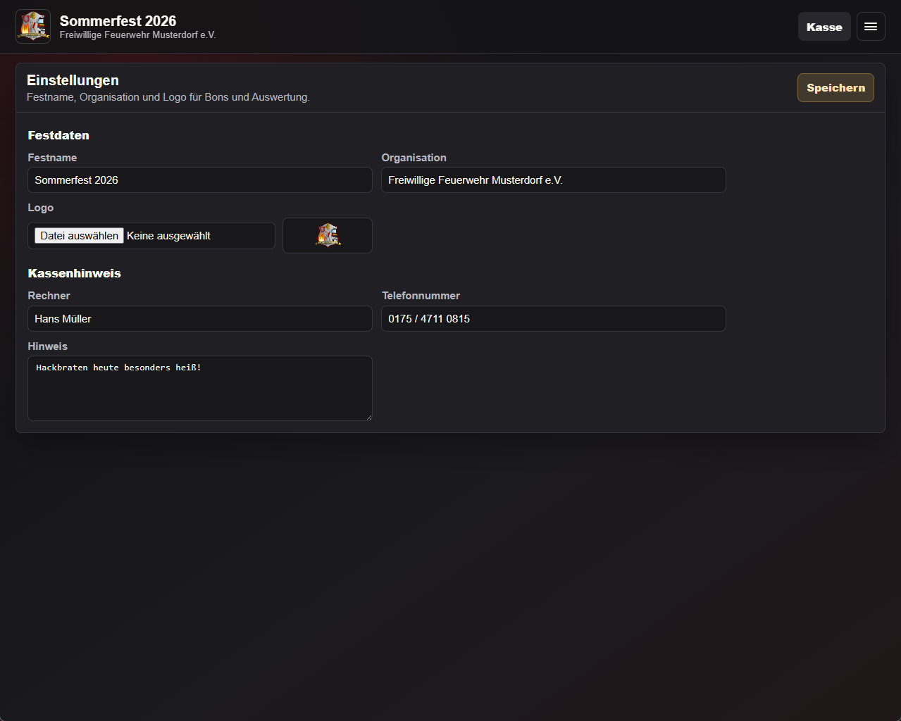

### Kategorien

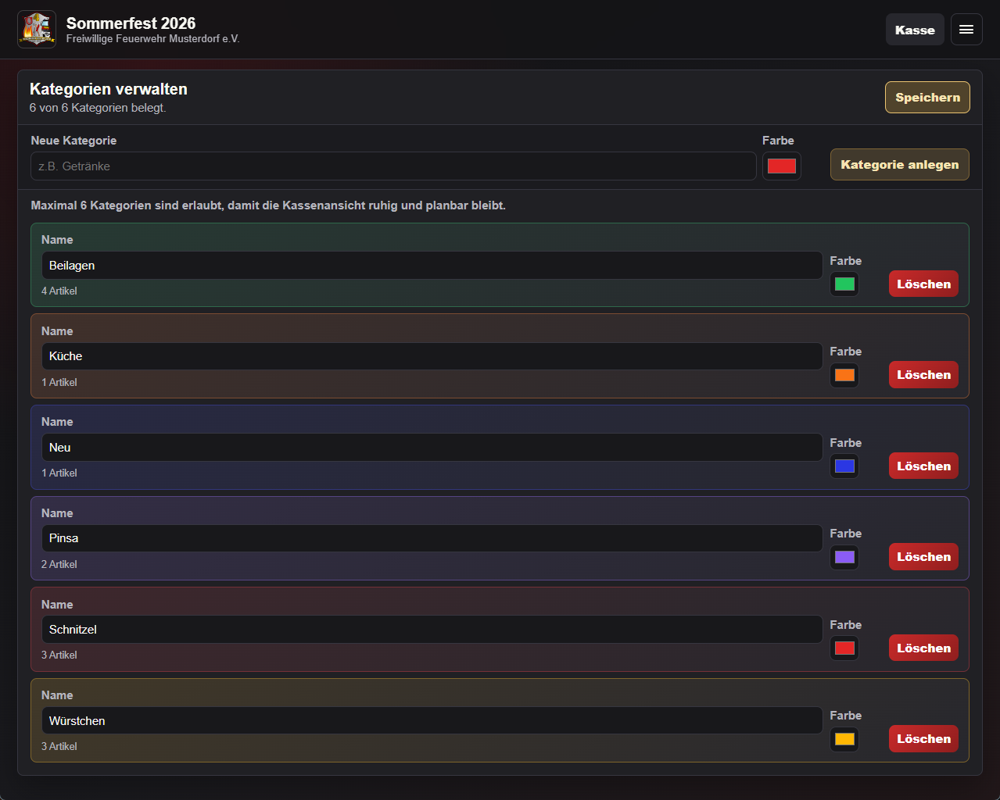

### Artikel

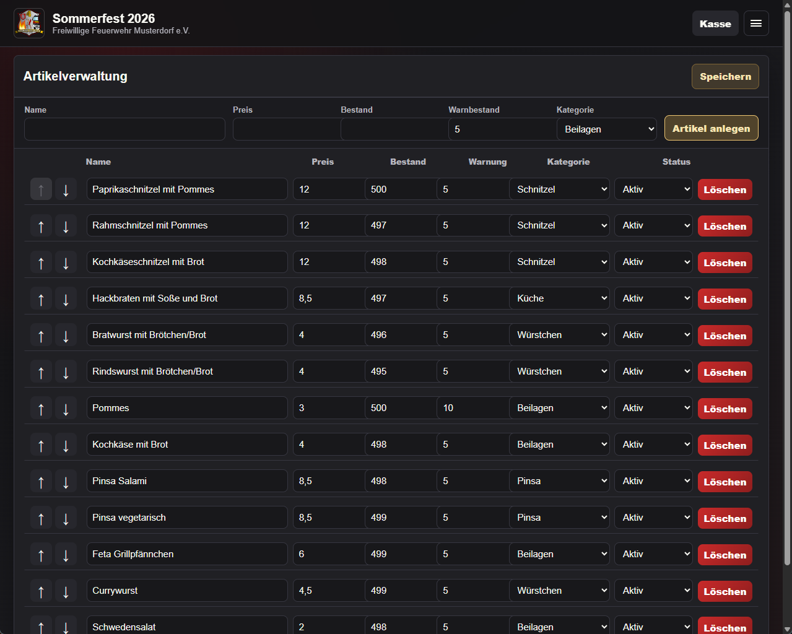

### Benutzer und Passwörter

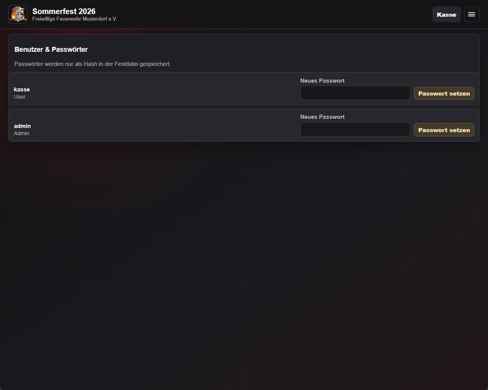

### Drucken

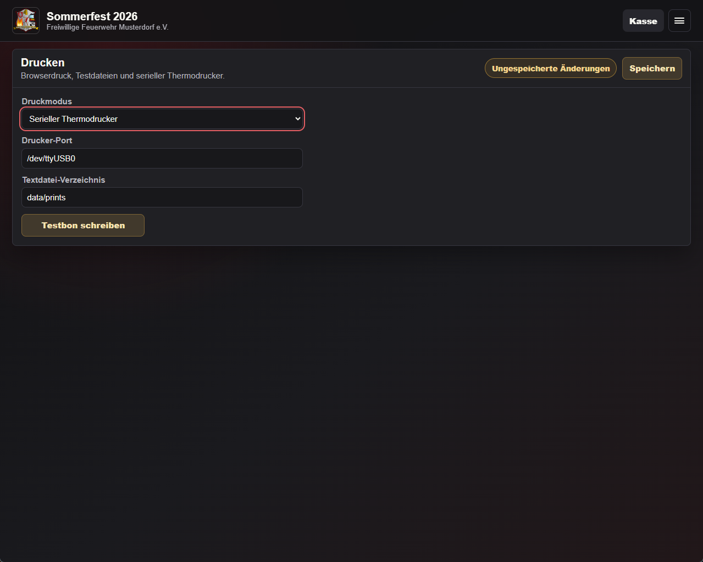

### Daten und Vorlagen

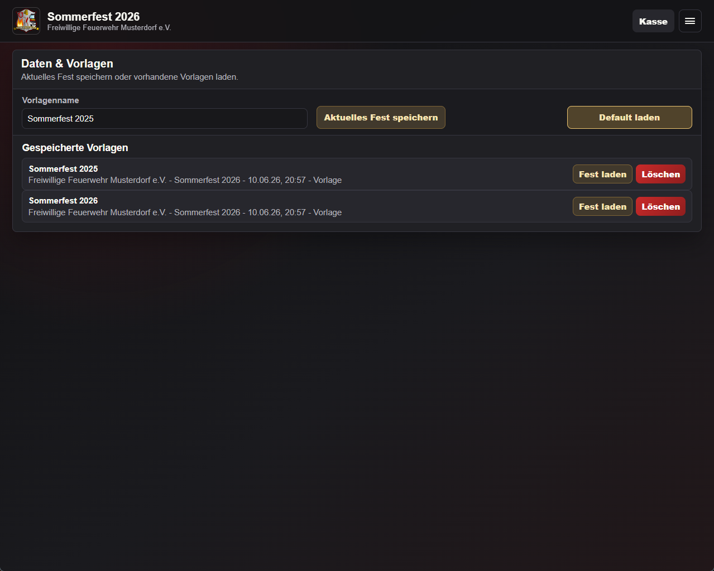

### Systeminformationen

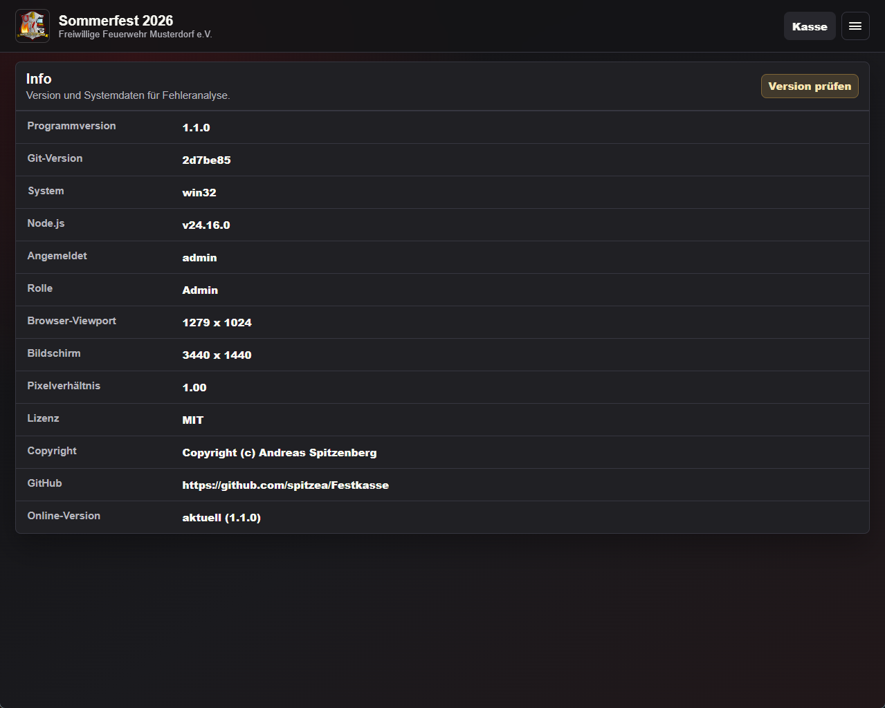

[Zurück zur README](../README.md)
